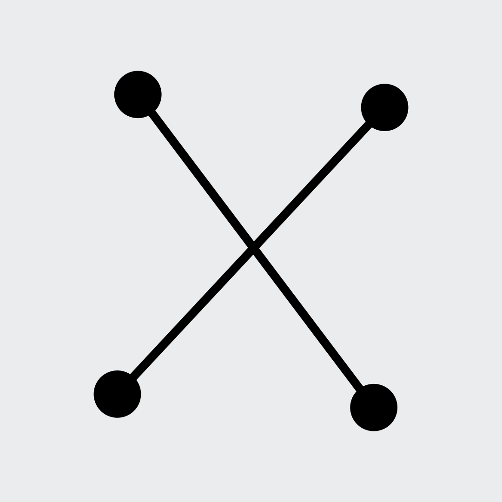
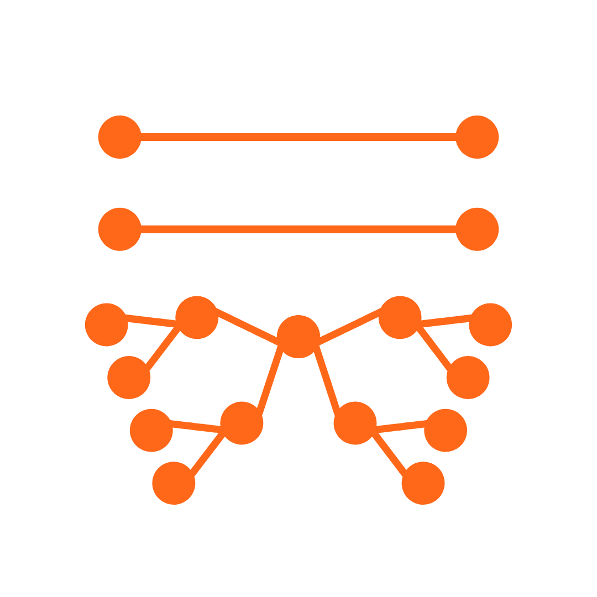
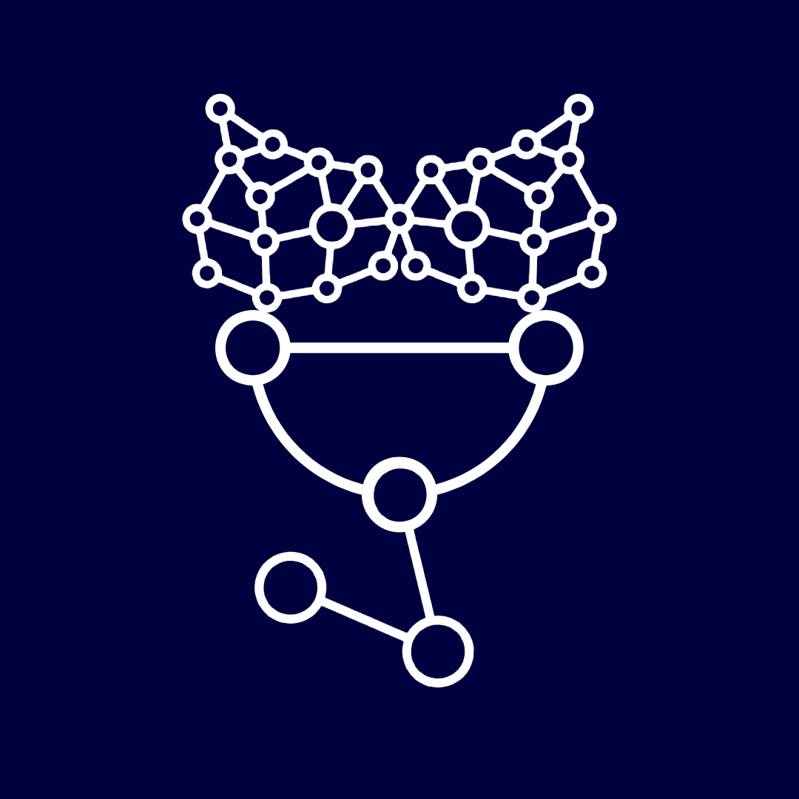
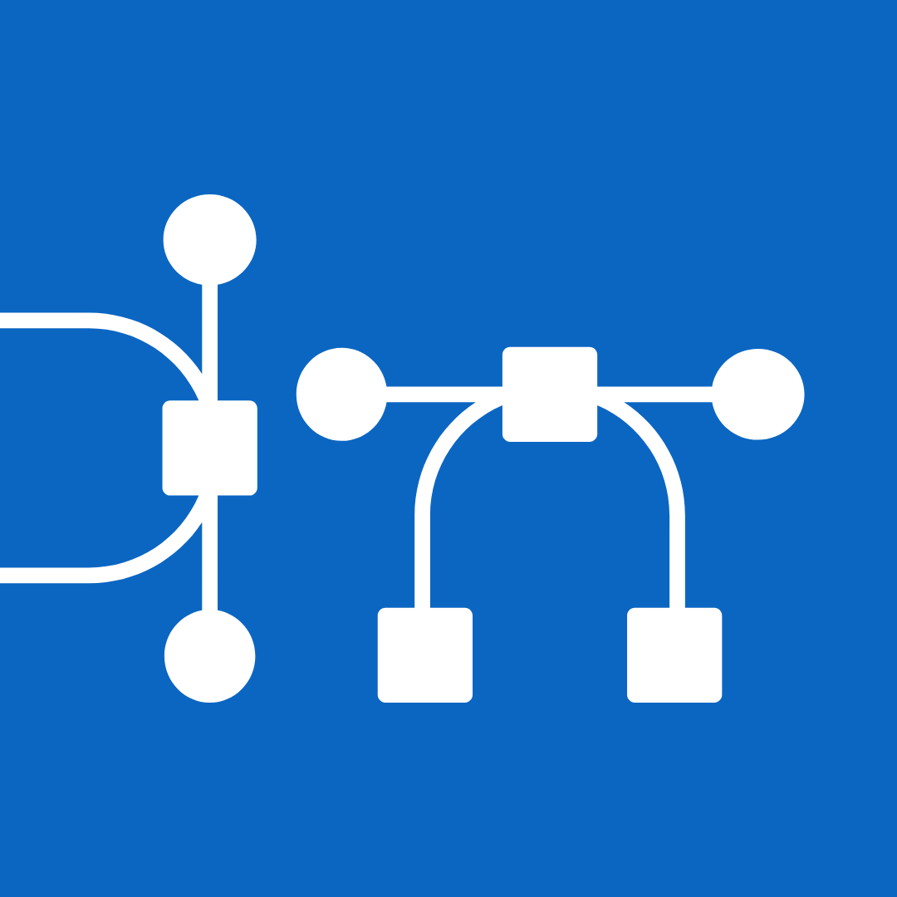
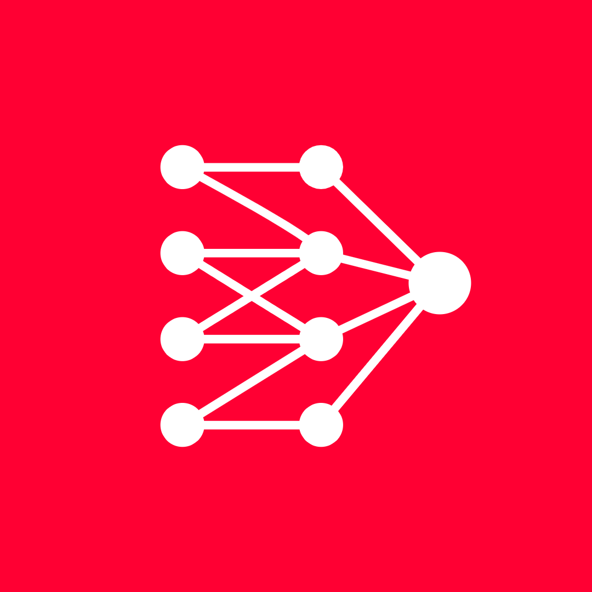

I'm Ammar Aldawood, a rigorous generalist operating at the intersection of  
biology, mathematics, computation, and engineering. A Medical Laboratory  
Sciences alumnus from Jordan University of Science and Technology, I became  
increasingly quantitative in my approach toward the life sciences.  

I am currently transitioning into bioengineering and computational biology.  
I am actively seeking PhD positions as well as industry roles where the  
environment suits the interdisciplinary problems I want to work on, and  
where my skills match the problems the lab or organization needs solved.  

If you see that fit in my work, [get in touch ✉](mailto:aldawoodammar@gmail.com).

---

## Where You Can Find Me

::: {.find-me-platform}
<a href="https://x.com/aldawood_ammar" target="_blank" rel="noopener"></a>

### X

This is the place where I'm most active. I post daily, so back-and-forth  
in the replies, and posts on what I'm learning, building, and thinking   
about in real time. If you want the in-progress version of my work and  
thinking process, follow along there so you you can keep current.

[Follow me on X](https://x.com/aldawood_ammar){.btn .btn-primary target="_blank" rel="noopener"}
:::

::: {.find-me-platform}
<a href="https://ammaraldawood.substack.com" target="_blank" rel="noopener"></a>

### Substack

Substack is where I post my long-form writing: essays and opinion pieces  
with room to argue points. Become a subscriber and the writing lands in  
your inbox.

[Subscribe on Substack](https://ammaraldawood.substack.com){.btn .btn-primary target="_blank" rel="noopener"}
:::

::: {.find-me-platform}
<a href="https://github.com/ammaraldawood" target="_blank" rel="noopener"></a>

### GitHub

GitHub is where this website and any of my coding projects live. Follow so  
new repos and commits show up when I push them. If you're detail-oriented,  
there might be some issue-resolving and conversations on there that may be  
of interest to you.

[Follow me on GitHub](https://github.com/ammaraldawood){.btn .btn-primary target="_blank" rel="noopener"}
:::

::: {.find-me-platform}
<a href="https://www.linkedin.com/in/ammar-aldawood/" target="_blank" rel="noopener"></a>

### LinkedIn

LinkedIn is the place to connect if you want to keep in touch about work.  
I may also publish work-related writing on it as it happens, so  
it's worth connecting there even if you follow me elsewhere.

[Connect on LinkedIn](https://www.linkedin.com/in/ammar-aldawood/){.btn .btn-primary target="_blank" rel="noopener"}
:::

::: {.find-me-platform}
<a href="https://www.youtube.com/@ammar_aldawood" target="_blank" rel="noopener"></a>

### YouTube

The channel isn't shipping videos yet, but it will. Subscribe now so  
you're already in the room when the first videos land.

[Subscribe on YouTube](https://www.youtube.com/@ammar_aldawood){.btn .btn-primary target="_blank" rel="noopener"}
:::

---

## Education & Learning

```{r}
library(tidyverse)

df <- data.frame(
  education = c(
    "BSc in Medical\n Laboratory Sciences",
    "MSc in Microbiology\n and Immunology",
    "Mathematics,\nComputation and Omics"
  ),
  start = c("2017-10-15", "2021-10-15", "2022-06-15"),
  end = c("2021-07-21", "2026-10-31", "2026-10-31"),
  mode = c("Formal Education", "Formal Education", "Autodidacticism")
)

df <- df %>%
  mutate(start = as.Date(start), end = as.Date(end))

df_tidy <- df %>%
  gather(key = date_type, value = date, -education, -mode)

ggplot() +
  geom_line(
    data = df_tidy,
    mapping = aes(
      x = fct_rev(fct_inorder(education)),
      y = date,
      color = mode
    ),
    linewidth = 10
  ) +
  coord_flip() +
  labs(x = "", y = "") +
  scale_color_manual(values = c(
    "Formal Education" = "#F7DD7D",
    "Autodidacticism" = "#406AAF"
  )
  ) +
  theme(
    legend.title = element_blank(),
    plot.background = element_rect(fill = "transparent", color = NA),
    panel.background = element_rect(fill = "transparent", color = NA),
    legend.background = element_rect(fill = "transparent", color = NA),
    panel.grid.major = element_blank(),
    panel.grid.minor = element_blank(),

    text = element_text(color = "white", linewidth = 12),
    axis.text = element_text(color = "white", linewidth = 12),
    axis.title = element_text(color = "white", linewidth = 12),
    plot.title = element_text(color = "white", linewidth = 12),
    legend.text = element_text(color = "white", linewidth = 12)
  )

```
<span class="badge bg-light">Gantt chart generated using ggplot2 in R</span>

---

## My Tech Stack
##### Hover over nodes to see more info!

```{r}
library(plotly)

n1 <- c("Assembly", "C", "C++", "Python", "R")
n2 <- c("Swift", "SQL", "Shell", "Docker", "Git")

c1 <- c("steelblue", "firebrick", "steelblue", "mistyrose", "mistyrose")
c2 <- c("mistyrose", "mistyrose", "firebrick", "mistyrose", "mistyrose")

node_descriptions <- c(
  "Low level programming.\nLearned it purely to become more\ngrounded in computation and\nunderstand the full picture down to hardware.\nSkill level: ★",
  "Mid level programming.\nUseful for optimization and\nhigh performance computing.\nGives the best control over embedded systems.\nSkill level: ★★",
  "Mid level programming.\nA superset of C that is relevant for\ninteroperability with higher level languages.\nSkill level: ★",
  "High level programming.\nGives access to mature machine learning\npackages such as XGBoost & PyTorch.\nContains the package Biopython.\nSkill level: ★★★★",
  "High level programming.\nSpecialized in data visualization and\nstatistical data analysis.\nContains the library Bioconductor.\nSkill level: ★★★★",
  "High level programming.\nNative app development for more than five different platforms\nin iOS, iPadOS, macOS, watchOS, visionOS..etc.\nSkill level: ★★★★",
  "Structured query language.\nEssential for any meaningful work using big data.\nBest way to interact with relational databases.\nSkill level: ★★★",
  "Command line interface.\nProvides broad access over the system you're working on.\nEssential for scripting and SSH-ing.\nSkill level: ★★★★",
  "Containerization and Reproducibility.\nSkill level: ★★",
  "Version Control and Reproducibility.\nSkill level: ★★★★"
)

fig <- plot_ly(
               type = "sankey",
               arrangement = "snap",
               orientation = "v",
               node = list(
                           label = c(n1, n2),
                           color = c(c1, c2),
                           pad = 15,
                           customdata = node_descriptions,
                           hovertemplate = "%{customdata}<extra></extra>"),
               link = list(
                           source = c(0, 1, 1, 1, 1, 2, 2, 2, 6, 6, 7, 7),
                           target = c(1, 2, 3, 4, 5, 3, 4, 5, 3, 4, 8, 9),
                           value = c(6, 3, 1, 1, 1, 1, 1, 1, 1, 1, 1, 1),
                           color = c("steelblue", "firebrick", "firebrick",
                            "firebrick", "firebrick", "steelblue",
                            "steelblue", "steelblue", "mistyrose",
                            "mistyrose", "firebrick", "firebrick"),                           
                            hoverinfo = "none"))
fig <- fig %>% layout(title = "",
  paper_bgcolor = "rgba(0,0,0,0)",
  plot_bgcolor = "rgba(0,0,0,0)",
  font = list(color = "#000000", size = 12, family = "Arial"),
  margin = list(
    l = 70,
    r = 70,
    b = 50,
    t = 50
  ),
  hoverlabel = list(
    bgcolor = "rgba(255, 255, 255, 1)",
    bordercolor = "rgba(0, 0, 0, 1)",
    font = list(color = "black")
  )
)

fig
```
<span class="badge bg-light">Sankey diagram generated using Plotly in R</span>

---

## Interests & Hobbies
##### Click on the circles to see more!


```{r}
library(circlepackeR)

data <- data.frame(
  root = rep("root", 11),
  group = c(
    rep("Sports", 3),
    rep("Languages", 3),
    rep("Music", 2),
    rep("Digital Creation", 1),
    rep("Learning", 2)
  ),
  subgroup = rep(c(
    "Calisthenics",
    "Running",
    "Swimming",
    "Arabic",
    "English",
    "Mandarin",
    "Playing Piano",
    "Music Theory",
    "Procedural 3D Simulation in SideFX Houdini",
    "Reading",
    "Research"
  )
  ),
  value = c(100, 25, 25, 100, 100, 5, 25, 25, 50, 100, 100)
)

library(data.tree)
data$pathString <- paste(
  "world",
  data$group,
  data$subgroup,
  data$subsubgroup,
  sep = "/"
)
population <- as.Node(data)

p <- circlepackeR(
  population, 
  size = "value",
  color_min = "hsl(190, 80%, 60%)", # Bright oceanic blue for inner nodes
  color_max = "hsl(345, 80%, 35%)"  # Deep rich crimson/red for outer containers
)

p
```
<span class="badge bg-light">Circle packing generated using circlepackeR in R</span>
